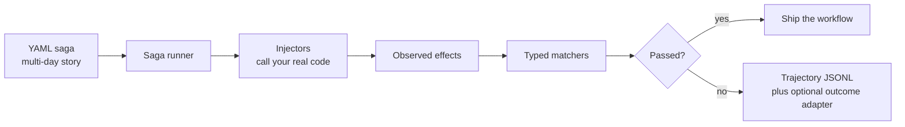

# Saga

[](https://github.com/Torus-Intelligence/saga-core/actions/workflows/ci.yml)
[](./LICENSE)
[](./package.json)

Scenario tests for workflows that are too long for unit tests and too internal
for browser tests.

Saga is for the product behavior that usually gets tested by vibes: a customer
opens a case, the system classifies it, an engineer approves or escalates it,
the customer follows up days later, and the right side effects need to happen
at every step. Instead of clicking through a UI or mocking the whole world, you
write the story as YAML, drive your real workflow code through small injectors,
and assert the typed effects your system emitted.

When a Saga fails, it tells you which expected effect was missing and can dump a
JSONL trajectory of the events, observations, and failures. That gives humans
and coding agents a compact debugging trail without turning Saga into an eval
framework or a second application.

```bash
git clone https://github.com/Torus-Intelligence/saga-core.git
cd saga-core && bun install
bun run test:examples
```

[Example](./examples/tickets) · [Agent skill](./skills/saga) · [Contributing](./CONTRIBUTING.md) · [Security](./SECURITY.md)

## The Shape



Saga sits between unit tests and end-to-end tests:

| Question | Usual test | Saga's job |
|---|---|---|
| Did this function branch work? | Unit test | Too small for Saga. |
| Did the UI button render? | Browser E2E | Too indirect for Saga. |
| Did this multi-step backend workflow behave correctly over time? | Usually manual QA or hope | Saga fixture. |
| Did a failure deserve a PR or a ticket? | Human triage | Optional outcome adapter. |

## What It Feels Like

Saga is for workflows that unfold over multiple steps:

```text
day 1  customer files a ticket
day 1  agent classifies it and drafts a response
day 2  support engineer approves or escalates
day 6  customer follows up
```

The test does not click a browser or fake an HTTP contract. It calls your real
workflow functions through injectors and verifies the effects they emit.

```text
fixture story       your adapter            product code          Saga verdict
-------------       ------------            ------------          ------------
customer files  ->  injectTicketCreated  ->  createTicket()    ->  TicketCreated
agent classifies ->  injectClassification ->  classifyTicket()  ->  TicketClassified
engineer reviews -> injectEngineerReview -> approveResponse() -> ResponseSent
customer returns -> injectFollowUp       -> createFollowUp()  -> SatisfactionSurveyReceived
```

## Install

Source checkout:

```bash
git clone https://github.com/Torus-Intelligence/saga-core.git
cd saga-core
bun install
bun run test:examples
```

When published to npm:

```bash
bun add @torus/saga
```

For coding agents, copy or install the bundled skill from `skills/saga` and
ask:

```text
Use $saga to add a Saga fixture for the new escalation workflow.
```

## 60 Second Version

```ts
import { z } from "zod";
import {
  BaseSagaEventSchema,
  BaseSagaManifestSchema,
  MatcherRegistry,
  runSagaCore,
} from "@torus/saga";

const TicketEffect = z.discriminatedUnion("effect", [
  z.object({
    effect: z.literal("TicketCreated"),
    priority: z.enum(["low", "medium", "high"]).optional(),
  }),
]);

const TicketEvent = BaseSagaEventSchema.extend({
  kind: z.enum(["customer_files_ticket"]),
  expected_effects: z.array(TicketEffect).optional(),
}).passthrough();

const TicketManifest = BaseSagaManifestSchema.extend({
  events: z.array(TicketEvent).min(1),
});

const matchers = new MatcherRegistry().register("TicketCreated", (expected, observed) => {
  return expected.priority === undefined || observed.payload.priority === expected.priority;
});

const result = await runSagaCore("./fixtures/simple-ticket.saga.yaml", {
  manifestSchema: TicketManifest,
  matchers,
  dispatch: async ({ event }) => {
    const ticket = await createTicket(event);
    return {
      observations: [
        {
          effect: "TicketCreated",
          payload: { id: ticket.id, priority: ticket.priority },
        },
      ],
    };
  },
});

console.log(`${result.passed.length}/${result.total_assertions} assertions passed`);
```

The fixture:

```yaml
saga_id: simple-ticket
harness_version: 1
duration_days: 1
events:
  - at: 2026-06-01T09:00:00Z
    kind: customer_files_ticket
    actor: alex
    subject: Cannot export dashboard
    expected_effects:
      - effect: TicketCreated
        priority: high
    save:
      ticket_id: effects.TicketCreated[0].id
```

The same pattern scales to multi-day stories with `save:` and `{{saved.name}}`
for cross-event continuity.

## Why Not X

| Tool style | What it is good at | Why Saga exists |
|---|---|---|
| Unit tests | Pure functions and local branches. | Too small for cross-step workflow regressions. |
| Browser E2E | User-visible UI behavior. | Too slow and indirect for backend or agent pipelines. |
| Contract tests | Provider and consumer compatibility. | Does not verify the full internal workflow. |
| BDD text tests | Human-readable acceptance cases. | Usually string-bound and weakly typed. |
| Eval harnesses | Model quality and task success. | Saga is a dev-tool harness for product code paths. |

## What Saga Provides

| Surface | Purpose |
|---|---|
| `runSagaCore` | Load YAML, sort events, dispatch events, verify assertions. |
| `MatcherRegistry` | Register typed comparison logic per effect kind. |
| `save:` | Capture values from one event and use them later with `{{saved.name}}`. |
| `TrajectoryRecorder` | Record each event, observation, and failure as JSONL. |
| Outcome adapters | Fail fast, draft a PR, open a ticket, or route by severity. |
| Persona modules | Scrape, fingerprint, discriminate, and evolve synthetic cast members. |

## Codex Skill

`skills/saga` tells Codex how to:

- author `*.saga.yaml` fixtures;
- wire event schemas, effect schemas, injectors, and matchers;
- inspect trajectory failures;
- configure fail-stop, auto-PR, ticket, and hybrid outcome adapters;
- use persona simulation without putting private domain data in the core library.

## Example App

`examples/tickets` is a neutral customer-support app:

- In-memory ticket backend.
- Deterministic classification loop.
- Four injectors.
- Eight effect types.
- Five multi-day saga fixtures.

Run it:

```bash
bun run test:examples
```

## Design Rules

- Keep Saga generic. Domain-specific events, effects, injectors, and persona
  dimensions belong in the consuming app.
- Drive real product logic through DI boundaries. Stub nondeterministic services
  such as LLMs, databases, ticket trackers, git hosts, and wall-clock time.
- Match typed effects, not prose.
- Treat Saga as a pre-human gate. Passing synthetic scenarios is not production
  validation.

## Repository Map

```text
src/
  runner.ts              YAML loader and event dispatcher
  verifier.ts            effect matcher and save capture logic
  trajectory.ts          JSONL trajectory dump support
  outcomes/              fail-stop, auto-PR, ticket, hybrid adapters
  persona/               scrape, fingerprint, discriminator, evolve
examples/tickets/        neutral reference app
skills/saga/               Codex skill for AI agents using Saga
```

## Development

```bash
bun install
bun run typecheck
bun run test
bun run test:examples
```

## Status

The API is early and expected to change before 1.0.
